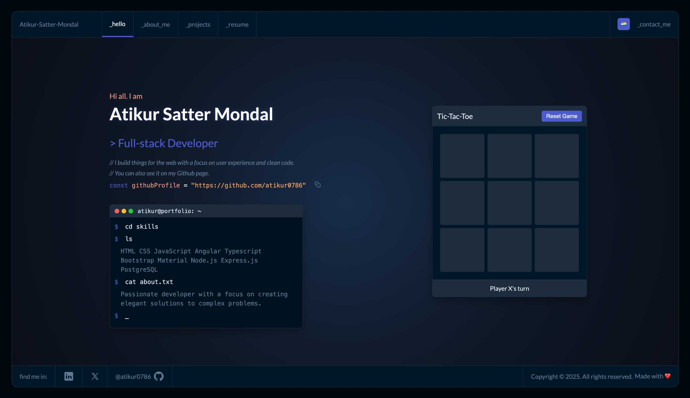

# Atikur's Portfolio



## Overview

A personal portfolio website showcasing my skills, projects, and professional background with a clean, code editor-inspired interface.

## Features

- **Interactive Navigation**: Easy-to-use menu system
- **Responsive Design**: Optimized for both desktop and mobile devices
- **Code Editor Aesthetic**: Modern developer-friendly UI
- **Project Showcase**: Detailed display of my work
- **Resume Section**: Professional background and skills
- **Contact Form**: Direct way to get in touch

## Technologies Used

- HTML5
- CSS3
- JavaScript
- Responsive Design Principles

## Project Structure

```
├── index.html          # Main HTML file
├── styles.css          # Main stylesheet
├── script.js           # JavaScript functionality
└── assets/             # Images and other assets
```

## Contact

Atikur Satter Mondal

- Email: atikursattermondal@gmail.com
- LinkedIn: [LinkedIn Profile](https://www.linkedin.com/in/atikur-satter-mondal-a302ba1a5)
- GitHub: [GitHub Profile](https://github.com/atikur0786)
- X (Twitter): [X Profile](https://twitter.com/atikursatter)

Feel free to reach out for any inquiries or collaboration opportunities.
